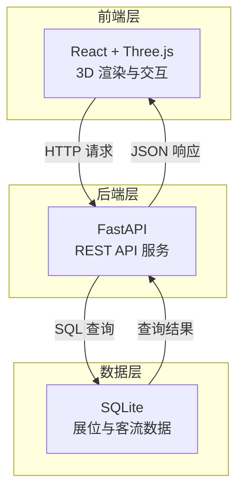
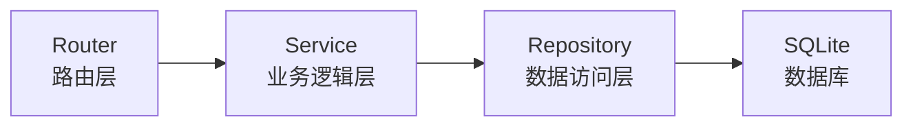
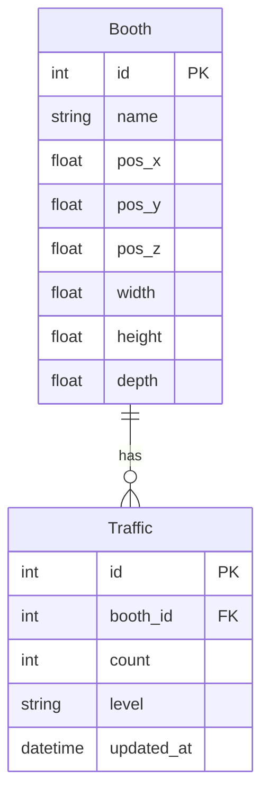

## 1. 架构设计



## 2. 技术说明

- **前端**：React 18 + TypeScript + Vite + TailwindCSS + Three.js (@react-three/fiber + @react-three/drei + @react-three/postprocessing)
- **初始化工具**：vite-init (react-ts 模板)
- **后端**：Python 3 + FastAPI + Uvicorn
- **数据库**：SQLite（文件型数据库，零配置）
- **状态管理**：Zustand

## 3. 路由定义

| 路由 | 用途 |
|------|------|
| / | 3D 展厅看板主页面 |

## 4. API 定义

### 4.1 获取所有展位

```
GET /api/booths
Response 200:
{
  "booths": [
    {
      "id": 1,
      "name": "A区-智能硬件",
      "position": { "x": -4.0, "y": 0.0, "z": -3.0 },
      "size": { "width": 2.0, "height": 0.3, "depth": 2.0 }
    }
  ]
}
```

### 4.2 获取所有展位客流量

```
GET /api/traffic
Response 200:
{
  "traffic": [
    {
      "booth_id": 1,
      "name": "A区-智能硬件",
      "count": 156,
      "level": "high"
    }
  ],
  "total": 980,
  "updated_at": "2026-06-22T10:30:00Z"
}
```

### 4.3 获取指定展位客流量

```
GET /api/booths/{booth_id}/traffic
Response 200:
{
  "booth_id": 1,
  "name": "A区-智能硬件",
  "count": 156,
  "level": "high",
  "updated_at": "2026-06-22T10:30:00Z"
}
```

## 5. 服务器架构图



## 6. 数据模型

### 6.1 数据模型定义



### 6.2 数据定义语言

```sql
CREATE TABLE booths (
    id INTEGER PRIMARY KEY AUTOINCREMENT,
    name TEXT NOT NULL,
    pos_x REAL NOT NULL,
    pos_y REAL NOT NULL,
    pos_z REAL NOT NULL,
    width REAL NOT NULL DEFAULT 2.0,
    height REAL NOT NULL DEFAULT 0.3,
    depth REAL NOT NULL DEFAULT 2.0
);

CREATE TABLE traffic (
    id INTEGER PRIMARY KEY AUTOINCREMENT,
    booth_id INTEGER NOT NULL REFERENCES booths(id),
    count INTEGER NOT NULL DEFAULT 0,
    level TEXT NOT NULL DEFAULT 'low',
    updated_at TEXT NOT NULL DEFAULT (datetime('now'))
);

CREATE INDEX idx_traffic_booth_id ON traffic(booth_id);
```

### 6.3 初始数据

插入 12 个展位的初始数据，分布在展厅四个区域（A/B/C/D 区各 3 个展位），客流量数据涵盖 low/medium/high 三个级别。

## 7. 项目目录结构

```
de4/
├── src/                          # 前端代码
│   ├── components/
│   │   ├── Scene.tsx             # 3D 场景主组件
│   │   ├── HallModel.tsx         # 展厅模型（方块）
│   │   ├── HeatSphere.tsx        # 热力球体组件
│   │   └── InfoPanel.tsx         # 左侧信息面板
│   ├── hooks/
│   │   └── useTrafficData.ts     # 客流数据获取 Hook
│   ├── pages/
│   │   └── Dashboard.tsx         # 主看板页面
│   ├── stores/
│   │   └── useStore.ts           # Zustand 状态管理
│   ├── types/
│   │   └── index.ts              # TypeScript 类型定义
│   ├── utils/
│   │   └── heatmap.ts            # 热力颜色计算工具
│   ├── App.tsx
│   ├── main.tsx
│   └── index.css
├── api/                          # 后端代码
│   ├── main.py                   # FastAPI 应用入口
│   ├── database.py               # 数据库连接与初始化
│   ├── models.py                 # 数据模型
│   ├── routers/
│   │   ├── booths.py             # 展位路由
│   │   └── traffic.py            # 客流路由
│   ├── services/
│   │   ├── booth_service.py      # 展位业务逻辑
│   │   └── traffic_service.py    # 客流业务逻辑
│   └── seed.py                   # 初始数据填充脚本
├── package.json
├── vite.config.ts
├── tailwind.config.js
└── tsconfig.json
```
